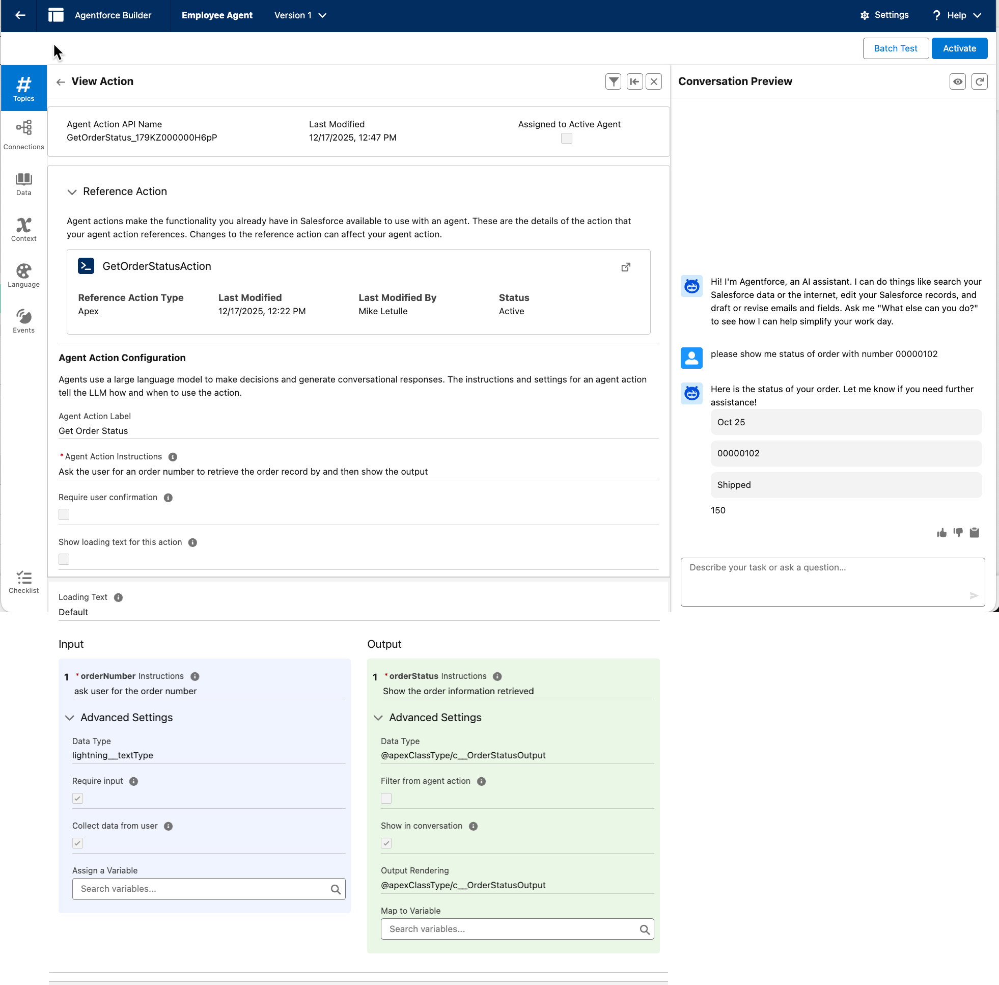

# Agentforce Custom Output: Order Status Renderer

This project demonstrates how to return a complex Apex object from an Agentforce Action and render it using a custom Lightning Web Component (LWC), rather than standard text.

## Overview
To enable Agentforce to display a custom UI card, we use a three-part architecture:
1.  **Apex Action:** Returns a specific "Wrapper" object to prevent Agentforce from flattening the data.
2.  **Custom Lightning Type:** Metadata that bridges the Apex class to the LWC.
3.  **LWC:** The visual component that renders the data.

## File Structure

### 1. The Data & Logic (Apex)
**`OrderStatusOutput.cls`**
The data model. Must use `@JsonAccess` to ensure Agentforce can serialize it.

**`GetOrderStatusAction.cls`**
The Invocable Method. **Crucial:** Uses a wrapper class (`ActionOutput`) containing the `OrderStatusOutput` object. This forces Agentforce to respect the object structure instead of flattening it into individual fields.

### 2. The Bridge (Metadata)
**`force-app/main/default/lightningTypes/OrderStatusType/`**
* `schema.json`: Maps the Custom Type to the Apex Class.
* `renderer.json`: Maps the Custom Type to the LWC.

### 3. The UI (LWC)
**`orderStatusRenderer`**
* **Target:** `lightning__AgentforceOutput`
* **Configuration:** Restricted to `c__OrderStatusType` in the `.js-meta.xml`.

## Deployment Instructions (Critical)

Because the LWC references the Custom Type, and the Custom Type references the LWC, you must deploy in a specific order to avoid validation errors.

**Step 1: Deploy LWC (Generic)**
Open `orderStatusRenderer.js-meta.xml` and **comment out** the `<targetConfigs>` section.

*Deploy the LWC folder to the Org.*

**Step 2: Deploy Lightning Types**
Deploy the `lightningTypes` folder. This will succeed now that the LWC exists.

**Step 3: Update & Redeploy LWC**
Uncomment the `<targetConfigs>` section in `orderStatusRenderer.js-meta.xml`.
*Deploy the LWC folder again.*

## Configuration Steps

1.  **Agent Builder:**
    * Create a new Action referencing the `GetOrderStatus` Apex class.
    * Navigate to the **Outputs** tab.
    * Select the `orderStatus` output variable (from the wrapper).
    * Set **Output Type** to `c__OrderStatusType` (Your Custom Lightning Type).
2.  **Testing:**
    * Use the Agent Preview to ask "Check status for order 123".
    * Verify the response renders the LWC card instead of a text summary.

## Troubleshooting
* **Missing "Apex-Defined" Option:** Ensure `OrderStatusOutput.cls` is a top-level class (not an inner class) and has the `@JsonAccess` annotation.
* **Fields "Flattened" in Builder:** Ensure the Apex Action returns a `List<ActionOutput>` wrapper, not `List<OrderStatusOutput>` directly.